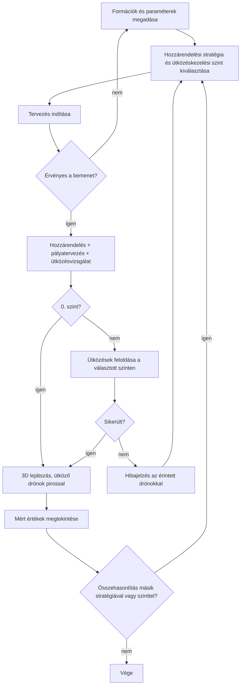
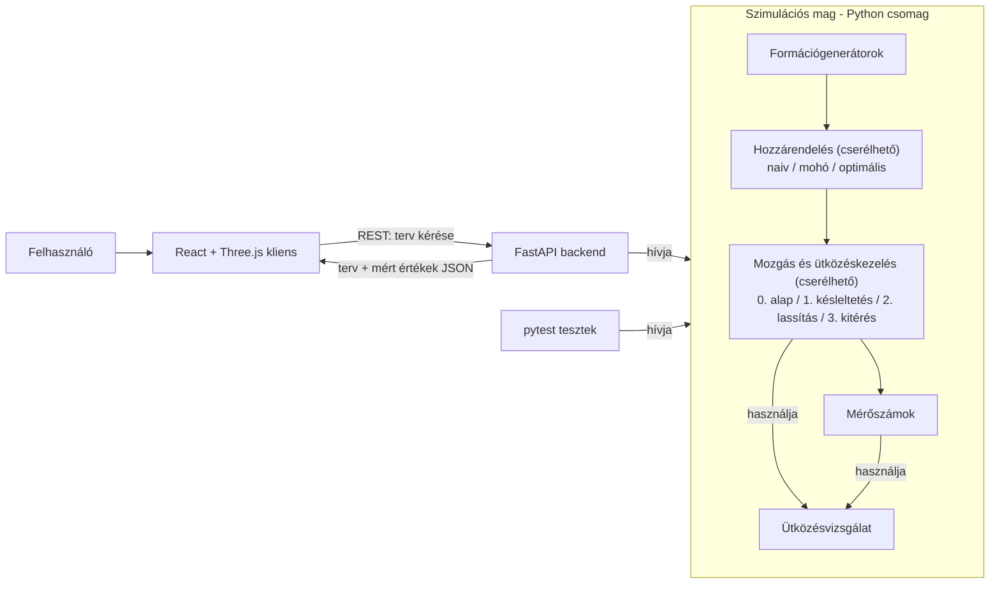

# Drónrajok optimális útvonaltervezésének és formációváltásának vizsgálata

## 1. Szereplők és jogosultságok

Az alkalmazásban nincs hitelesítés és nincsenek fiókok, ezért a szerepek csak a használati célokat különítik el.

| Szerep | Igény | Felelősség / hozzáférés |
| --- | --- | --- |
| Show-tervező (drónos fényshow-k koreográfusa vagy szervezője) | Annak eldöntése, hogy két alakzat között adott drónszámmal és drónképességekkel kivitelezhető-e az átmenet, mennyi ideig tart, és melyik megoldás a legkedvezőbb | Kiválasztja az alakzatokat (presetet vagy egyedi pozíciólistát) és megadja a mozgási korlátokat; megtervezteti és megtekinti az átmenetet; a mért értékek alapján kiválasztja a számára megfelelő megoldást. |
| Kísérletező (rajrobotika iránt érdeklődő vagy kutató) | A hozzárendelési stratégiák és az ütközéskezelési szintek működésének megértése és összehasonlítása | Változtatja a paramétereket, a stratégiát és az ütközéskezelési szintet, ugyanarra a bemenetre több változatot futtat; a lejátszás és a mért értékek alapján értelmezi a különbségeket. |
| Oktató / értékelő (témavezető) | A teljes rendszer megismerése és értékelése: működik-e a specifikált funkcionalitás, érthető-e és használható-e a felület, teljesülnek-e a mérhető sikerkritériumok, valamint a szimuláció és a megjelenítés szétválasztása, a tesztek és a dokumentáció minősége | Ugyanazt a felületet használja, mint a többi szerep; kipróbálja a főbb folyamatokat és a hibás bemenetek kezelését; a mért eredményeket azonos bemenettel reprodukálhatja. |

A use case-ekben a „felhasználó” a fenti három szerep bármelyikét jelöli, mivel mindannyian ugyanazt a felületet használják.

### Fogalmak

- **Hozzárendelési stratégia:** meghatározza, melyik drón melyik célpozícióba repül (naiv, mohó vagy optimális).
- **Ütközéskezelési szint:** meghatározza, hogyan jutnak el a drónok a célpozícióikba, és mit tesz a rendszer, ha két drón ütközne (0–3. szint, lásd 8. szakasz).
- **Ütközés (konfliktus):** két drón távolsága valamely pillanatban kisebb a beállított biztonsági távolságnál (d_safe).
- **Preset:** előre elkészített, beégetett formáció rögzített drónszámmal (pl. „Gömb – 100 drón”). Minden alakzat (rács, gömb, kör, spirál) több rögzített méretben érhető el: 10, 50, 100 és 500 drónnal. Preset választásakor a drónszámot a preset határozza meg, a felhasználó nem adja meg külön.
- **Terv:** az összes drón időben paraméterezett pályája egy adott bemenetre, stratégiára és szintre.

## 2. Use case-ek / user storyk

### 1: Formációváltás megtervezése

- **Szereplő:** Felhasználó
- **Előfeltétel:** A kliens eléri a backendet.
- **Fő folyamat:**
  1. A felhasználó kiválasztja a kezdőformációt (preset vagy egyedi pozíciólista). A drónszámot a kezdőformáció határozza meg: preset esetén a presetben rögzített érték, egyedi lista esetén a pontok száma.
  2. Kiválasztja a célformációt (preset vagy egyedi pozíciólista). A rendszer csak a kezdőformációval azonos drónszámú preseteket kínálja fel.
  3. Beállítja a mozgási paramétereket (végsebesség, gyorsulás, biztonsági távolság).
  4. Kiválasztja a hozzárendelési stratégiát és az ütközéskezelési szintet.
  5. Elindítja a tervezést.
  6. A rendszer kiosztja a célpozíciókat, megtervezi a pályákat és megkeresi az ütközéseket; az 1. szinttől felfelé fel is oldja azokat.
  7. A rendszer visszaadja a megtervezett átmenetet és a mért értékeket.
- **Alternatív / hibafolyamatok:**
  - Ha a kezdő- és a célformáció pontjainak száma eltér (egyedi lista esetén), a rendszer hibaüzenettel elutasítja a kérést.
  - Ha egy formáción belül két pozíció közelebb van egymáshoz a biztonsági távolságnál, a rendszer hibát jelez.
  - Ha a paraméterek érvénytelenek (pl. nem pozitív sebesség), a rendszer nem indít tervezést.
  - A 0. szinten a rendszer nem oldja fel az ütközéseket: a terv elkészül, de tartalmazza az észlelt ütközések listáját (érintett drónok és időpont).
  - Ha az 1–3. szinten a választott szint nem tudja feloldani az ütközéseket (pl. egyenes pályás szinten két drón helyet cserélne), a rendszer jelzi a sikertelenséget, megnevezi az érintett drónokat, és nem ad vissza hibás tervet.
- **Utófeltétel:** Az 1–3. szinten ütközésmentes, a mozgási korlátokat betartó terv áll rendelkezésre. A 0. szinten a terv betartja a mozgási korlátokat, és az észlelt ütközések listáját is tartalmazza.

### 2: Átmenet megtekintése 3D-ben

- **Szereplő:** Felhasználó
- **Előfeltétel:** Elkészült egy formációváltási terv.
- **Fő folyamat:**
  1. A kliens 3D-ben megjeleníti a drónokat a kezdőpozíciókban.
  2. A felhasználó elindítja a lejátszást.
  3. A drónok a megtervezett pályákon mozognak, a felhasználó forgathatja, nagyíthatja a nézetet.
  4. Ha a terv ütközést tartalmaz (0. szint), a kliens az érintett drónokat piros színnel jeleníti meg, amíg a távolságuk a biztonsági távolság alatt van.
- **Alternatív / hibafolyamatok:** Ha nincs terv, a lejátszás vezérlői le vannak tiltva.
- **Utófeltétel:** A felhasználó vizuálisan ellenőrizte az átmenetet.

### 3: Megoldások összehasonlítása

- **Szereplő:** Kísérletező, show-tervező, értékelő
- **Előfeltétel:** Ugyanazokkal a bemenetekkel legalább két terv elkészült, amelyek a hozzárendelési stratégiában, az ütközéskezelési szintben vagy mindkettőben eltérnek.
- **Fő folyamat:**
  1. A felhasználó ugyanarra a bemenetre lefuttatja a kiválasztott stratégia–szint párosításokat.
  2. A rendszer táblázatban egymás mellé teszi a mért értékeket (formációváltási idő, összes megtett távolság, számítási idő, észlelt ütközések száma, ütközéselkerülés okozta többletidő, minimális távolság).
  3. A felhasználó bármelyik terv lejátszását elindíthatja.
- **Utófeltétel:** Az eredmények összevethetők és exportálhatók.

### 4: Egyedi formáció megadása

- **Szereplő:** Felhasználó
- **Fő folyamat:**
  1. A felhasználó feltölt vagy beilleszt egy pozíciólistát (JSON vagy CSV, soronként `x, y, z`).
  2. A rendszer ellenőrzi a formátumot és a pontok számát.
  3. A rendszer kezdő- vagy célformációként elfogadja a listát.
- **Alternatív / hibafolyamatok:** Hibás formátum esetén a rendszer hibát dob.



## 3. Funkcionális követelmények

| Követelmény | Elfogadási kritérium | Prioritás |
| --- | --- | --- |
| A rendszer tetszőleges számú drónt és 3D célpozíciót kezel. | Adott N ≥ 1 drónnál és N kezdő- és N célpozíciónál (egyedi listával tetszőleges N, presetekkel N = 10, 50, 100 vagy 500) a tervezés lefut; legalább N = 10, 50, 100 és 500 értékekkel igazoltan. | Kötelező |
| A felhasználó presetet választhat kezdő- és célformációnak. | Adott alakzatnál (rács, gömb, kör, spirál) mind a négy méretben (10, 50, 100, 500 drón) elérhető preset; kiválasztásakor a drónszám a presetben rögzített értékre áll, és célformációként csak azonos drónszámú presetek választhatók. | Kötelező |
| A rendszer tetszőleges drónszámra is előállítja az előre definiált alakzatokat. | Adott alakzatnál és a felhasználó által megadott N drónszámnál a rendszer pontosan N, egymástól legalább d_safe távolságra lévő pozíciót generál. | Lehetséges |
| A felhasználó egyedi pozíciólistát adhat meg. | Adott érvényes JSON/CSV listánál a rendszer elfogadja; hibás vagy eltérő számú ponttal elutasítja. | Kötelező |
| A mozgási paraméterek konfigurálhatók: végsebesség, gyorsulás, biztonsági távolság. | Adott paraméterértékeknél a terv ezek szerint készül, és az érték megváltoztatása a tervet érdemben megváltoztatja. | Kötelező |
| A rendszer három hozzárendelési stratégiát valósít meg (naiv, mohó, optimális), és a felhasználó választhat közöttük. | Adott bemenetnél mindhárom stratégia érvényes hozzárendelést ad: minden drónhoz pontosan egy célpozíció tartozik, és minden célpozíciót pontosan egy drón kap. | Kötelező |
| A hozzárendelés és az ütközéskezelés egymástól függetlenül választható és cserélhető. | Adott bemenetnél bármely stratégia bármely megvalósított szinttel kombinálva lefuttatható. | Kötelező |
| A rendszer minden drónhoz megtervezi az útvonalat a mozgásmodell szerint. | Adott tervnél minden drón a kezdőpozícióból a hozzárendelt célpozícióba ér, és ott megáll. | Kötelező |
| A drónok mozgása minden szinten betartja a beállított végsebességet és gyorsulást. | Adott tervnél a mintavételezett pályákon minden pillanatban \|v\| ≤ v_max és \|a\| ≤ a_max. | Kötelező |
| A rendszer észleli a drónok közötti ütközéseket (0. szint). | Adott tervnél a rendszer felsorolja azokat a drónpárokat és időpontokat, ahol két drón távolsága d_safe alá csökken; ütközésmentes tervnél a lista üres. | Kötelező |
| A rendszer késleltetett indulással elkerüli az ütközéseket (1. szint). | Adott, egyenes pályán feloldható bemenetnél a kész tervben bármely két drón távolsága a teljes mozgás alatt legalább d_safe, és a drónok csak indulási idejükben térnek el a 0. szint tervétől. | Kötelező |
| A rendszer menet közbeni lassítással vagy várakozással elkerüli az ütközéseket (2. szint). | Adott, egyenes pályán feloldható bemenetnél a kész tervben bármely két drón távolsága legalább d_safe, a drónok pályája egyenes marad, és a lassítás is betartja a gyorsulási korlátot. | Ajánlott |
| A rendszer nem egyenes, kitérő pályákkal is elkerüli az ütközéseket (3. szint). | Adott olyan bemenetnél is, amely egyenes pályán nem oldható fel (pl. két drón helycseréje), a kész tervben bármely két drón távolsága legalább d_safe. | Lehetséges |
| A rendszer felismeri, ha a választott szint nem tudja feloldani az ütközéseket. | Adott feloldhatatlan bemenetnél (pl. két drón helycseréje egyenes pályás szinten) a rendszer hibát jelez, megnevezi az érintett drónokat, és nem ad vissza tervet. | Kötelező |
| A rendszer minden futásban méri a teljes formációváltási időt és az összes megtett távolságot. | Adott futás eredménye tartalmazza a formációváltási időt (az utolsó drón megérkezése) és az összes drón által megtett távolság összegét. | Kötelező |
| A rendszer méri a számítási költséget és a minimális megvalósult drónközi távolságot. | Adott futás eredménye tartalmazza a tervezés idejét és a legkisebb mért drónközi távolságot. | Kötelező |
| A rendszer méri az ütközéskezelés hatását. | Adott futás eredménye tartalmazza a feloldás előtt észlelt ütközések számát és az ütközéselkerülés okozta többletidőt (a választott szint és a 0. szint formációváltási idejének különbsége). | Kötelező |
| A kliens 3D-ben megjeleníti és lejátssza a megtervezett átmenetet. | Adott tervnél a drónok a kezdőpozícióból a célformációba mozognak, a nézet forgatható és nagyítható. | Kötelező |
| A kliens pirossal jelöli az ütköző drónokat. | Adott ütközést tartalmazó tervnél (0. szint) az érintett drónok pirossal jelennek meg, amíg távolságuk d_safe alatt van, utána visszakapják eredeti színüket. | Ajánlott |
| A lejátszás vezérelhető: indítás, szünet, visszatekerés, sebesség. | Adott lejátszásnál a vezérlők a mozgást megfelelően befolyásolják. | Ajánlott |
| A felhasználó összehasonlíthatja a különböző stratégia–szint párosítások mért értékeit. | Adott bemenetnél a futtatott párosítások mért értékei egy táblázatban egymás mellett jelennek meg. | Kötelező |
| A mért eredmények exportálhatók. | Adott futásoknál a mért értékek CSV vagy JSON formában letölthetők. | Ajánlott |
| A kliens megjeleníti a hozzárendelést (vonalak a kezdő- és célpozíció között). | Adott tervnél be- és kikapcsolható a hozzárendelés vizualizációja. | Lehetséges |

Prioritás: **Kötelező** = a végtermékhez szükséges; **Ajánlott** = fontos; **Lehetséges** = idő esetén opcionális.

## 4. Üzleti szabályok és korlátok

| Szabály vagy korlát | Indoklás |
| --- | --- |
| A drónok száma megegyezik a kezdő- és a célpozíciók számával; a hozzárendelés kölcsönösen egyértelmű. | Minden drónnak pontosan egy célja van, és minden célpozíciót pontosan egy drón foglal el. |
| Minden drón az indulásnál és az érkezésnél áll (kezdő- és végsebesség 0). | A formáció stabil, megismételhető állapotot kell, hogy adjon. |
| A sebesség nagysága nem haladhatja meg a v_max értéket, a gyorsulásé az a_max értéket, minden ütközéskezelési szinten. | A projektkiírás mozgási korlátokat ír elő. |
| Az 1–3. szinten bármely két drón távolsága a teljes formációváltás alatt legalább d_safe. A 0. szinten ez nem követelmény, de minden megsértését jelezni kell. | Ez az ütközésmentesség mérhető definíciója; a 0. szint az összehasonlítás kiindulópontja. |
| Az ütközésvizsgálatban a még el nem indult (kezdőpozícióban várakozó) és a már megérkezett drónok is részt vesznek. | Egy álló drón is akadály a többiek számára. |
| Egy formáción belül bármely két pozíció között legalább d_safe távolság kell, hogy legyen. | Különben a formáció eleve ütközést jelentene. |
| 1–2. szinten a konfliktus akkor oldható fel, ha létezik olyan végrehajtási sorrend, amelyben a drónok pályái konfliktusmentesen bejárhatók. Egy drón kezdő- vagy célpozíciójának másik drón útvonalán való elhelyezkedése önmagában nem teszi szükségessé a 3. szintet, ha az érintett drón előzetes elmozdításával a konfliktus megszüntethető. A 3. szint csak akkor szükséges, ha ilyen sorrend nem létezik. | Egyenes pályán csak az indulás és a sebesség időzítése változtatható, ezért a feloldhatóság a sorrenden múlik. |
| A formációváltási idő az utolsó drón megérkezésének ideje, beleértve a késleltetéseket és a várakozásokat; az összes távolság a drónok pályahosszainak összege. | Egyértelmű, reprodukálható mérőszámok az összehasonlításhoz. |
| A tervezés teljesen determinisztikus: nem tartalmaz véletlen elemet, azonos bemenet és beállítások mindig azonos tervet adnak. | Az összehasonlítás csak így reprodukálható. |
| A szimuláció állapota nem függ a megjelenítéstől. | A projektkiírás megköveteli a szimuláció és a megjelenítés elkülönítését. |
| A repó nem tartalmaz titkos kulcsot, tokent, személyes vagy éles adatot. | A projektkiírás előírása. |

## 5. Felhasználói felület és munkafolyamat

Az alkalmazás egyetlen oldal, amelynek bal oldalán a vezérlőpanel, jobb oldalán a 3D nézet van. Alul a lejátszás sávja és a mért értékek táblázata látható.

```text
+------------------------------------------------------------------------------+
| Drónraj formációváltás                                                       |
+---------------------------+--------------------------------------------------+
| BEÁLLÍTÁSOK               |                                                  |
| Kezdőformáció:            |                                                  |
|   [Rács – 100 drón  v]    |                   3D nézet                       |
|   (egyedi lista...)       |            (forgatható, nagyítható;              |
| Célformáció:              |         ütköző drónok piros kiemeléssel)         |
|   [Gömb – 100 drón  v]    |                                                  |
|   (egyedi lista...)       |                                                  |
| Drónok száma: 100         |                                                  |
|   (a formációból adódik)  |                                                  |
| v_max:   [ 10 ] m/s       |                                                  |
| a_max:   [  4 ] m/s²      |                                                  |
| d_safe:  [  1 ] m         |                                                  |
| Hozzárendelés: [Optimális v]                                                 |
| Ütközéskezelés: [1. Késleltetett indulás v]                                  |
| [ Tervezés ] [ Összehasonlítás ]                                             |
+---------------------------+--------------------------------------------------+
| |<  >  ||  idő: 00:12 / 00:25   sebesség: [1x v]                             |
+------------------------------------------------------------------------------+
| Hozzárend. | Szint | Idő  | Táv. össz. | Számítás | Ütközés | Többlet | Min.  |
| Naiv       | 0     | 31 s | 3 420 m    | 0,05 s   | 57      | –       | 0,0 m |
| Naiv       | 1     | 46 s | 3 420 m    | 0,60 s   | 57      | +15 s   | 1,0 m |
| Optimális  | 1     | 25 s | 2 310 m    | 0,40 s   | 3       | +1 s    | 1,0 m |
+------------------------------------------------------------------------------+
```

A fő folyamat: paraméterek megadása → hozzárendelési stratégia és ütközéskezelési szint kiválasztása → tervezés → lejátszás → mért értékek megtekintése → szükség esetén másik stratégia vagy szint kipróbálása ugyanarra a bemenetre. Hiba esetén a vezérlőpanel jelez, feloldhatatlan ütközésnél az érintett drónok megnevezésével.

## 6. Nem funkcionális követelmények

| Követelmény | Ellenőrzés módja |
| --- | --- |
| **Skálázhatóság:** a rendszer legalább 500 drónig működik. | Mért futtatások 10, 50, 100 és 500 drónnal. |
| **Teljesítmény (cél):** 100 drón tervezése legfeljebb 5 s, 500 drón tervezése legfeljebb 60 s. A célértékek az első mérések után pontosítandók. | A tervezési idő mérése a futtatások során. |
| **Pontosság:** a mozgási korlátok megsértése minden szinten, a biztonsági távolság megsértése az 1–3. szinten nulla a mért futásokban. | Automatizált, a tervezéstől független ellenőrzés a mintavételezett pályákon (v, a, min. távolság). |
| **Bővíthetőség:** új hozzárendelési stratégia vagy ütközéskezelési szint a meglévők módosítása nélkül hozzáadható. | Kódáttekintés: a stratégiák és a szintek közös interfészt valósítanak meg. |
| **Szétválasztás:** a szimulációs és optimalizálási mag megjelenítés és hálózat nélkül futtatható és tesztelhető. | A mag külön csomag; tesztjei kliens és szerver nélkül lefutnak. |
| **Reprodukálhatóság:** ugyanaz a bemenet és ugyanazok a beállítások ugyanazt az eredményt adják. | Automatizált teszt két futás összehasonlításával. |
| **Használhatóság:** egy első alkalommal használó külső dokumentáció nélkül el tud indítani egy formációváltást. | Megfigyeléses használhatósági teszt egy-két személlyel. |
| **Biztonság:** a repó nem tartalmaz titkot; a bemenetek (pozíciólista, paraméterek) validáltak. | Kódáttekintés, validációs tesztek hibás bemenettel. |

## 7. Nyitott kérdések és kockázatok

| Kérdés / kockázat | Hatás | Felelős | Feloldás / döntés |
| --- | --- | --- | --- |
| Mely hozzárendelési stratégiák kerüljenek összehasonlításra? | Meghatározza a kutatási rész tartalmát. | Hallgató, témavezető | **Döntés:** naiv (sorszám szerinti, az ütközéskezelés próbájaként), mohó (legközelebbi szabad cél) és optimális (magyar módszer a távolságnégyzetek összegére). Lehetséges bővítés: a legkésőbbi érkezést minimalizáló (bottleneck) hozzárendelés. |
| Hogyan vizsgáljuk az ütközéseket: adott időközönkénti mintavételezéssel vagy a pályák függvényéből számolt legkisebb távolsággal (analitikusan)? Minden drónpárt összehasonlítunk, vagy előszűréssel csökkentjük a vizsgált párok számát? | Meghatározza az ütközésvizsgálat pontosságát, számítási költségét és megvalósítási nehézségét; minden ütközéskezelési szint erre épül. | Hallgató, témavezető | **Tisztázandó, konzultáció szükséges.** A lehetőségeket a 8. szakasz foglalja össze. Az időlépés megválasztása mintavételezésnél külön kockázat: túl nagy lépésnél két gyors drón észrevétlenül átrepülhet egymáson. |
| Ütközés esetén melyik drón enged elsőbbséget (késleltet, lassít vagy vár)? | Befolyásolja a többletidőt és a feloldhatóságot. | Hallgató, témavezető | **Nyitott.** Lehetséges szabályok: a rövidebb utat megtevő drón vár, vagy rögzített sorszám szerinti prioritás. |
| A 2. szint előre tervezett legyen (a tervező előre kiszámolja a lassításokat), vagy reaktív (a szimuláció lépésenként figyel, és a drón menet közben dönt)? | Befolyásolja a 2. szint felépítését és az ütközésvizsgálat módját. | Hallgató, témavezető | **Nyitott, a 2. félévben az 1. szint elkészülte után döntendő.** Mindkét esetben a szerver állítja elő a teljes tervet, a kliens csak lejátssza. |
| Az ütközésfeloldás megnöveli-e jelentősen a formációváltási időt? | Befolyásolja a stratégiák és szintek összehasonlítását. | Hallgató | Minden futásban rögzítjük a 0. szint és a választott szint idejét; a többletidő külön mérőszám. |
| A metrika (összes távolság vs. legkésőbbi érkezés) szerint a legjobb stratégia nem azonos. | Az „optimális” fogalma kétértelmű. | Hallgató | Mindkét mérőszám rögzítése; a kiértékelés bemutatja az eltérést. |
| Valós idejű szimuláció vagy előre kiszámított pályák? | Befolyásolja az API-t és a klienst. | Hallgató | **Javasolt:** előre kiszámított pályák; a kliens csak lejátssza, így a szimuláció a megjelenítéstől független. |
| Szükséges-e WebSocket, vagy elég a REST? | Befolyásolja az architektúrát. | Hallgató | **Javasolt:** REST; WebSocket csak hosszan futó tervezés előrehaladásának jelzéséhez, ha szükséges. |
| Mekkora a 500 drón pályaadatának mérete és megjelenítési terhelése? | Befolyásolja a válaszidőt és az FPS-t. | Hallgató | - |
| Python vagy Java legyen a backend? | Befolyásolja a teljes fejlesztést. | Hallgató, témavezető | **Döntés:** Python (NumPy, SciPy, FastAPI); indoklás a 8. szakaszban. |

## 8. Kezdeti technikai javaslat

### Javasolt megoldás

A rendszer három rétegből áll:

1. **Szimulációs mag** (Python-csomag): formációgenerátorok, hozzárendelési stratégiák, ütközéskezelési szintek, ütközésvizsgálat és mérőszámok. Nem függ a webes rétegtől.
2. **Backend API** (FastAPI): vékony réteg, amely validálja a kéréseket, meghívja a magot és JSON-ban visszaadja a tervet és a mért értékeket.
3. **Kliens** (React, TypeScript, Three.js): a bemenetek megadása, a terv lejátszása és a mért értékek megjelenítése. A kliens nem tartalmaz optimalizálási logikát.

A szimulációs magban a **hozzárendelés** és az **ütközéskezelés** két külön, cserélhető modul. Mindkettőnek közös interfésze van, a változatok ezt valósítják meg (stratégia tervezési minta). Így a fokozatos fejlesztés új változat hozzáadását jelenti, nem a meglévő kód átírását, és bármely stratégia bármely szinttel kombinálható.

A tervezés főbb lépései:

1. **Formációk betöltése:** preset (beégetett pozíciólista rögzített drónszámmal) vagy egyedi lista. Tetszőleges drónszámú alakzatok generálása csak lehetséges bővítés.
2. **Hozzárendelés** a kiválasztott stratégiával:
   - *Naiv:* az i-edik drón az i-edik célpozícióba repül. Nem optimalizál, ezért sok keresztező pályát ad; az ütközéskezelés próbájaként szolgál.
   - *Mohó:* a drónok sorszám szerint egymás után a hozzájuk legközelebbi szabad célt kapják. Gyors, de nem optimális.
   - *Optimális:* a magyar módszerrel a távolságnégyzetek összegét minimalizálja. A négyzetes költség ismert tulajdonsága, hogy egyenes pályák esetén kevesebb kereszteződést és ütközést eredményez; helycserét nem ad.
3. **Mozgás és ütközéskezelés** a kiválasztott szinten. A mozgásmodell minden szinten közös: pontszerű drón 3D-ben, legfeljebb v_max sebességgel és a_max gyorsulással; indulásnál és érkezésnél áll.

   | Szint | Működés | Pálya alakja | Prioritás |
   | --- | --- | --- | --- |
   | **0. Alap** | Minden drón egyszerre indul, egyenes vonalon, trapéz alakú sebességprofillal (gyorsítás, állandó sebesség, fékezés). Az ütközéseket csak észleli és jelzi, nem oldja fel. Ez az összehasonlítás kiindulópontja. | egyenes | Kötelező |
   | **1. Késleltetett indulás** | Ha két drón ütközne, az egyik később indul, így a közös szakaszon nem találkoznak. A teljes formációváltási idő nőhet. | egyenes | Kötelező |
   | **2. Menet közbeni lassítás / várakozás** | Ha két drón ütközne, az egyik menet közben lelassít vagy megáll, megvárja, amíg a másik elhalad, majd folytatja. | egyenes | Ajánlott |
   | **3. Kitérés** | A drón nem egyenes pályán, kitérve kerüli ki a másikat. Megoldhatja az egyenes pályán feloldhatatlan eseteket (pl. helycsere). | nem egyenes | Lehetséges |

   Az 1. és a 2. szint ugyanazt az egyenes pályát használja, csak a sebesség időbeli lefolyását módosítja (a pálya geometriája és a sebességprofil külön tervezhető). A 3. szint a pálya alakját is megváltoztatja, ezért lényegesen nehezebb.

4. **Ütközésvizsgálat:** minden szint alapja; a tervezés közben és a kész terv ellenőrzésénél is fut. A pontos módszer **tisztázandó** (lásd 7. szakasz). A szóba jövő lehetőségek:
   - *Két drón összehasonlítása:* adott időközönkénti **mintavételezés** (egyszerű, bármilyen pályára működik, de túl nagy időlépésnél ütközést hagyhat ki), vagy a pályák függvényéből **analitikusan** számolt legkisebb távolság (pontos, de csak ismert alakú, pl. egyenes pályára).
   - *A vizsgált párok száma:* minden pár összehasonlítása (a drónszámmal négyzetesen nő), vagy **kétfázisú** vizsgálat: olcsó előszűrés (pl. a térben egymástól távoli pályák), majd pontos vizsgálat csak a megmaradt párokon.
   - A kész terv ütközésmentességét a tesztek a tervezéstől független, mintavételezéses ellenőrzéssel is igazolják.
5. **Mérőszámok:** formációváltási idő, összes távolság, számítási idő, minimális drónközi távolság, a feloldás előtt észlelt ütközések száma, az ütközéselkerülés okozta többletidő, a megfigyelt maximális sebesség és gyorsulás.

### Technológiai irány

| Terület | Jelölt technológia / megközelítés | Megfontolás oka | Nyitott kérdés / kockázat |
| --- | --- | --- | --- |
| Szimulációs mag | Python, NumPy, SciPy | Gyors vektorizált számítás, kész magyar módszer, tapasztalat ML-projektekből | Az ütközésvizsgálat és -feloldás sebessége 500 drónnál; szükség esetén hatékonyabb vizsgálati módszer. |
| Backend | FastAPI | Típusos, gyorsan fejleszthető REST API, automatikus dokumentáció és validáció | A nagy pályaadat méretére méretezni kell. |
| Kliens | React, TypeScript | Meglévő tapasztalat, komponensalapú felület | – |
| 3D megjelenítés | Three.js | Sok azonos objektum hatékony kirajzolása WebGL-lel | 500 drón FPS-e. |
| Kommunikáció | REST (JSON) | A pályák előre kiszámítottak, így nem kell folyamatos adatfolyam | WebSocket csak előrehaladás-jelzéshez, ha kell. |
| Tesztelés | pytest, Hypothesis, kliensen Vitest | A tulajdonságalapú tesztek jól illenek a geometriai és kombinatorikai invariánsokhoz | – |

### Kezdeti architektúravázlat



### Megvalósíthatóság és technikai kockázatok

| Kockázat | Mit ellenőrzünk a 2. félévben? | Ha nem válik be |
| --- | --- | --- |
| Az ütközésvizsgálat pontos és gyors megvalósítása nehezebb a vártnál. | Először a legegyszerűbb módszerrel (minden pár összehasonlítása) készítjük el, és megmérjük, meddig elég gyors. | A témavezetővel egyeztetve egyszerűbb, de még elfogadható módszert választunk, vagy csökkentjük a vizsgált drónszámot. |
| Nagy drónszámnál nehéz elkerülni az ütközéseket, vagy ez túl sok időt ad hozzá a formációváltáshoz. | Kipróbáljuk 10, 50, 100 és 500 drónnal, és megmérjük, mennyivel hosszabb lesz a formációváltás. | Elfogadjuk a hosszabb időt (az 1. szinten ez megengedett), és eredményként dokumentáljuk. |
| Egyenes pályán nem minden eset oldható fel (pl. helycsere naiv hozzárendelésnél). | Célzott tesztesetekkel ellenőrizzük, hogy a rendszer felismeri és jelzi ezeket. | Az ilyen esetek a 3. szint feladatai; addig a rendszer hibát jelez. |
| A tervezés túl lassú lehet sok drónnál. | Megmérjük a tervezés idejét a különböző drónszámoknál. | Egyszerűbb vagy gyorsabb számítási módszerre váltunk. |
| A böngésző nem tudja folyamatosan megjeleníteni a sok drónt. | Korai prototípussal megnézzük, hogy 500 drónnál is gördülékeny-e az animáció. | Egyszerűbb megjelenítést használunk (kisebb részletesség). |
| Az „optimális” stratégia nem minden szempontból jobb (pl. rövidebb az összes út, de később ér célba az utolsó drón). | Minden futásnál több mérőszámot rögzítünk, és külön értékeljük őket. | Eredményként bemutatjuk a különbséget, és szükség esetén a bottleneck stratégiát is vizsgáljuk. |
| A tervezett pályák adatmennyisége nagy lehet. | Megmérjük, mekkora adatot kap a kliens 500 drónnál. | Tömörebb adatformátumot használunk. |