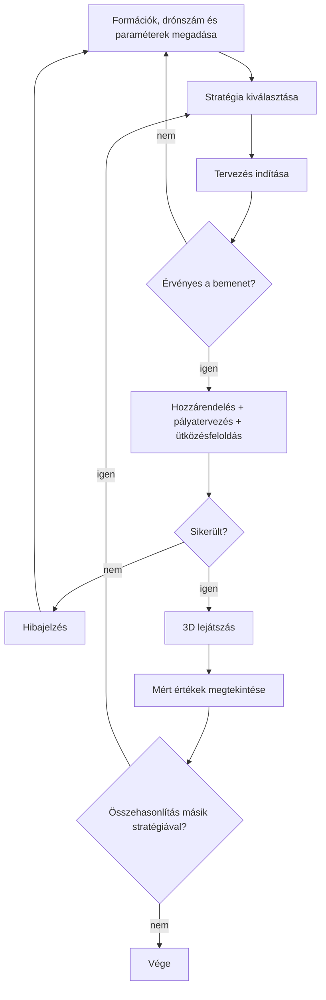
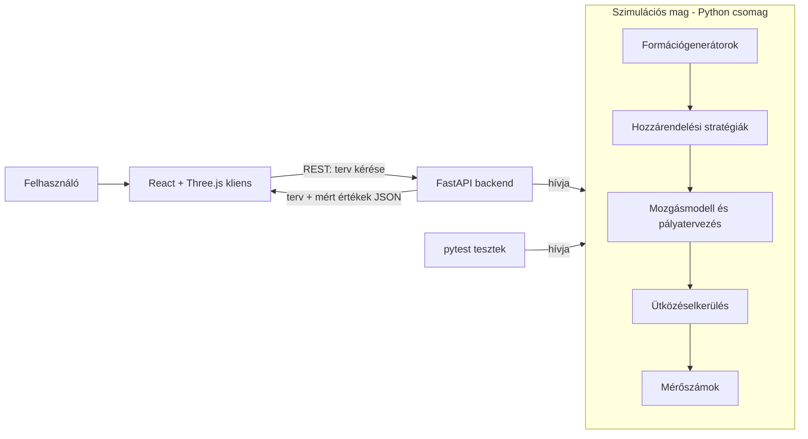

# Drónrajok optimális útvonaltervezésének és formációváltásának vizsgálata

## 1. Szereplők és jogosultságok

Az alkalmazásban nincs hitelesítés és nincsenek fiókok, ezért a szerepek csak a használati célokat különítik el.

| Szerep | Igény | Felelősség / hozzáférés |
| --- | --- | --- |
| Show-tervező (drónos fényshow-k koreográfusa vagy szervezője) | Annak eldöntése, hogy két alakzat között adott drónszámmal és drónképességekkel kivitelezhető-e az átmenet, mennyi ideig tart, és melyik megoldás a legkedvezőbb | Megadja a drónszámot, az alakzatokat és a mozgási korlátokat; megtervezteti és megtekinti az átmenetet; a mért értékek alapján kiválasztja a számára megfelelő stratégiát. |
| Kísérletező (rajrobotika iránt érdeklődő vagy kutató) | A formációváltási stratégiák működésének megértése és összehasonlítása | Változtatja a paramétereket és a stratégiát, ugyanarra a bemenetre több stratégiát futtat; a lejátszás és a mért értékek alapján értelmezi a különbségeket. |
| Oktató / értékelő (témavezető) | A teljes rendszer megismerése és értékelése: működik-e a specifikált funkcionalitás, érthető-e és használható-e a felület, teljesülnek-e a mérhető sikerkritériumok, valamint a szimuláció és a megjelenítés szétválasztása, a tesztek és a dokumentáció minősége | Ugyanazt a felületet használja, mint a többi szerep; kipróbálja a főbb folyamatokat és a hibás bemenetek kezelését; a mért eredményeket azonos bemenettel reprodukálhatja. |

A use case-ekben a „felhasználó” a fenti három szerep bármelyikét jelöli, mivel mindannyian ugyanazt a felületet használják.

## 2. Use case-ek / user storyk

### 1: Formációváltás megtervezése

- **Szereplő:** Felhasználó
- **Előfeltétel:** A kliens eléri a backendet.
- **Fő folyamat:**
  1. A felhasználó megadja a drónok számát.
  2. Kiválasztja a kezdő- és a célformációt (előre definiált alakzat vagy egyedi pozíciólista).
  3. Beállítja a mozgási paramétereket (végsebesség, gyorsulás, biztonsági távolság).
  4. Kiválasztja a hozzárendelési stratégiát.
  5. Elindítja a tervezést.
  6. A rendszer kiosztja a célpozíciókat, megtervezi a pályákat és feloldja az ütközéseket.
  7. A rendszer visszaadja a megtervezett átmenetet és a mért értékeket.
- **Alternatív / hibafolyamatok:**
  - Ha a kezdő- és célpozíciók száma eltér a drónszámtól, a rendszer hibaüzenettel elutasítja a kérést.
  - Ha a kezdő- vagy célpozíciók közelebb vannak egymáshoz a biztonsági távolságnál, a rendszer hibát jelez.
  - Ha a paraméterek érvénytelenek (pl. nem pozitív sebesség), a rendszer nem indít tervezést.
  - Ha az ütközések nem oldhatók fel a megengedett időn belül, a rendszer jelzi a sikertelenséget, és nem ad vissza hibás tervet.
- **Utófeltétel:** Egy ütközésmentes, mozgási korlátokat betartó terv áll rendelkezésre.

### 2: Átmenet megtekintése 3D-ben

- **Szereplő:** Felhasználó
- **Előfeltétel:** Elkészült egy formációváltási terv.
- **Fő folyamat:**
  1. A kliens 3D-ben megjeleníti a drónokat a kezdőpozíciókban.
  2. A felhasználó elindítja a lejátszást.
  3. A drónok a megtervezett pályákon mozognak, a felhasználó forgathatja, nagyíthatja a nézetet.
- **Alternatív / hibafolyamatok:** Ha nincs terv, a lejátszás vezérlői le vannak tiltva.
- **Utófeltétel:** A felhasználó vizuálisan ellenőrizte az átmenetet.

### 3: Stratégiák összehasonlítása

- **Szereplő:** Kísérletező, show-tervező, értékelő
- **Előfeltétel:** Ugyanazokkal a bemenetekkel legalább két stratégiával elkészült egy-egy terv.
- **Fő folyamat:**
  1. A felhasználó ugyanarra a bemenetre lefuttatja a kiválasztott stratégiákat.
  2. A rendszer táblázatban egymás mellé teszi a mért értékeket (formációváltási idő, összes megtett távolság, számítási idő, minimális távolság).
  3. A felhasználó bármelyik stratégia tervét lejátszhatja.
- **Utófeltétel:** Az eredmények összevethetők és exportálhatók.

### 4: Egyedi formáció megadása

- **Szereplő:** Felhasználó
- **Fő folyamat:**
  1. A felhasználó feltölt vagy beilleszt egy pozíciólistát (JSON vagy CSV, soronként `x, y, z`).
  2. A rendszer ellenőrzi a formátumot és a pontok számát.
  3. A rendszer kezdő- vagy célformációként elfogadja a listát.
- **Alternatív / hibafolyamatok:** Hibás formátum esetén a rendszer hibát dob.



## 3. Funkcionális követelmények

Követelmény | Elfogadási kritérium | Prioritás |
| --- | --- | --- |
A rendszer tetszőleges számú drónt és 3D célpozíciót kezel. | Adott N ≥ 1 drónnál és N kezdő- és N célpozíciónál a tervezés lefut; legalább N = 10, 50, 100 és 500 értékekkel igazoltan. | Kötelező |
A felhasználó előre definiált alakzatot választhat kezdő- és célformációnak. | Adott alakzatnál (rács, gömb, kör, vonal, spirál) és N drónnál a rendszer pontosan N pozíciót generál. | Kötelező |
A felhasználó egyedi pozíciólistát adhat meg. | Adott érvényes JSON/CSV listánál a rendszer elfogadja; hibás vagy eltérő számú ponttal elutasítja. | Kötelező |
A mozgási paraméterek konfigurálhatók: végsebesség, gyorsulás, biztonsági távolság. | Adott paraméterértékeknél a terv ezek szerint készül, és az érték megváltoztatása a tervet érdemben megváltoztatja. | Kötelező |
A rendszer legalább két hozzárendelési stratégiát valósít meg, és a felhasználó választhat közöttük. | Adott bemenetnél mindkét stratégia érvényes hozzárendelést ad: minden drónhoz pontosan egy célpozíció tartozik, és minden célpozíciót pontosan egy drón kap. | Kötelező |
A rendszer minden drónhoz megtervezi az útvonalat a mozgásmodell szerint. | Adott tervnél minden drón a kezdőpozícióból a hozzárendelt célpozícióba ér, és ott megáll. | Kötelező |
A drónok mozgása betartja a beállított végsebességet és gyorsulást. | Adott tervnél a mintavételezett pályákon minden pillanatban \|v\| ≤ v_max és \|a\| ≤ a_max. | Kötelező |
A rendszer elkerüli a drónok közötti ütközést. | Adott tervnél bármely két drón távolsága a teljes mozgás alatt legalább a beállított biztonsági távolság. | Kötelező |
A rendszer minden futásban méri a teljes formációváltási időt és az összes megtett távolságot. | Adott futás eredménye tartalmazza a formációváltási időt (az utolsó drón megérkezése) és az összes drón által megtett távolság összegét. | Kötelező |
A rendszer méri a számítási költséget és a minimális megvalósult drónközi távolságot. | Adott futás eredménye tartalmazza a tervezés idejét és a legkisebb mért drónközi távolságot. | Kötelező |
A kliens 3D-ben megjeleníti és lejátssza a megtervezett átmenetet. | Adott tervnél a drónok a kezdőpozícióból a célformációba mozognak, a nézet forgatható és nagyítható. | Kötelező |
A lejátszás vezérelhető: indítás, szünet, visszatekerés, sebesség. | Adott lejátszásnál a vezérlők a mozgást megfelelően befolyásolják. | Ajánlott |
A felhasználó összehasonlíthatja a stratégiák mért értékeit. | Adott bemenetnél a stratégiák mért értékei egy táblázatban egymás mellett jelennek meg. | Kötelező |
A mért eredmények exportálhatók. | Adott futásoknál a mért értékek CSV vagy JSON formában letölthetők. | Ajánlott |
A kliens megjeleníti a hozzárendelést (vonalak a kezdő- és célpozíció között). | Adott tervnél be- és kikapcsolható a hozzárendelés vizualizációja. | Lehetséges |

Prioritás: **Kötelező** = a végtermékhez szükséges; **Ajánlott** = fontos; **Lehetséges** = idő esetén opcionális.

## 4. Üzleti szabályok és korlátok

| Szabály vagy korlát | Indoklás |
| --- | --- |
| A drónok száma megegyezik a kezdő- és a célpozíciók számával; a hozzárendelés kölcsönösen egyértelmű (permutáció). | Minden drónnak pontosan egy célja van, és minden célpozíciót pontosan egy drón foglal el. |
| Minden drón az indulásnál és az érkezésnél áll (kezdő- és végsebesség 0). | A formáció stabil, megismételhető állapotot kell, hogy adjon. |
| A sebesség nagysága nem haladhatja meg a v_max értéket, a gyorsulásé az a_max értéket. | A projektkiírás mozgási korlátokat ír elő. |
| Bármely két drón távolsága a teljes mozgás alatt legalább d_safe. | Ez az ütközésmentesség mérhető definíciója. |
| A kezdő- és a célpozíciók között is legalább d_safe távolság kell, hogy legyen. | Különben a formáció eleve ütközést jelentene. |
| A formációváltási idő az utolsó drón megérkezésének ideje; az összes távolság a drónok pályahosszainak összege. | Egyértelmű, reprodukálható mérőszámok az összehasonlításhoz. |
| A tervezés determinisztikus, vagy a véletlen elemeket seed vezérli. | Az összehasonlítás csak így reprodukálható. |
| A szimuláció állapota nem függ a megjelenítéstől. | A projektkiírás megköveteli a szimuláció és a megjelenítés elkülönítését. |
| A repó nem tartalmaz titkos kulcsot, tokent, személyes vagy éles adatot. | A projektkiírás előírása. |

## 5. Felhasználói felület és munkafolyamat

Az alkalmazás egyetlen oldal, amelynek bal oldalán a vezérlőpanel, jobb oldalán a 3D nézet van. Alul a lejátszás sávja és a mért értékek táblázata látható.

```text
+----------------------------------------------------------------------+
| Drónraj formációváltás                                               |
+------------------------+---------------------------------------------+
| BEÁLLÍTÁSOK            |                                             |
| Drónok száma: [ 100 ]  |                                             |
| Kezdőformáció: [Rács v]|              3D nézet                       |
|   (egyedi lista...)    |        (forgatható, nagyítható)             |
| Célformáció:  [Gömb v] |                                             |
|   (egyedi lista...)    |                                             |
| v_max:   [ 10 ] m/s    |                                             |
| a_max:   [  4 ] m/s²   |                                             |
| d_safe:  [  1 ] m      |                                             |
| Stratégia: [Optimális v]                                             |
| [ Tervezés ] [ Összehasonl. ]                                        |
+------------------------+---------------------------------------------+
| |<  >  ||  idő: 00:12 / 00:31   sebesség: [1x v]                    |
+----------------------------------------------------------------------+
| Stratégia | Idő | Táv. összesen | Számítási idő | Min. távolság       |
| Mohó      | 31s | 2 840 m       | 0,02 s        | 1,0 m               |
| Optimális | 24s | 2 310 m       | 0,45 s        | 1,0 m               |
+----------------------------------------------------------------------+
```

A fő folyamat: paraméterek megadása → tervezés → lejátszás → mért értékek megtekintése → szükség esetén másik stratégia kipróbálása ugyanarra a bemenetre. Hiba esetén a vezérlőpanel jelez.

## 6. Nem funkcionális követelmények

| Követelmény | Ellenőrzés módja |
| --- | --- |
| **Skálázhatóság:** a rendszer legalább 500 drónig működik. | Mért futtatások 10, 50, 100 és 500 drónnal. |
| **Teljesítmény (cél):** 100 drón tervezése legfeljebb 5 s, 500 drón tervezése legfeljebb 60 s. A célértékek az első mérések után pontosítandók. | A tervezési idő mérése a futtatások során. |
| **Pontosság:** a mozgási korlátok és a biztonsági távolság megsértése nulla a mért futásokban. | Automatizált ellenőrzés a mintavételezett pályákon (v, a, min. távolság). |
| **Szétválasztás:** a szimulációs és optimalizálási mag megjelenítés és hálózat nélkül futtatható és tesztelhető. | A mag külön csomag; tesztjei kliens és szerver nélkül lefutnak. |
| **Reprodukálhatóság:** ugyanaz a bemenet és seed ugyanazt az eredményt adja. | Automatizált teszt két futás összehasonlításával. |
| **Használhatóság:** egy első alkalommal használó külső dokumentáció nélkül el tud indítani egy formációváltást. | Megfigyeléses használhatósági teszt egy-két személlyel. |
| **Biztonság:** a repó nem tartalmaz titkot; a bemenetek (pozíciólista, paraméterek) validáltak. | Kódáttekintés, validációs tesztek hibás bemenettel. |

## 7. Nyitott kérdések és kockázatok

| Kérdés / kockázat | Hatás | Felelős | Feloldás / döntés |
| --- | --- | --- | --- |
| Melyik két (vagy három) stratégia kerüljön összehasonlításra? | Meghatározza a kutatási rész tartalmát. | Hallgató, témavezető | **Javasolt:** (A) mohó legközelebbi hozzárendelés alapként, (B) optimális hozzárendelés (magyar módszer) a távolságnégyzetek összegére. Opcionális (C): a legkésőbbi érkezést minimalizáló (bottleneck) hozzárendelés. |
| Az ütközésfeloldás megnöveli-e jelentősen a formációváltási időt? | Torzíthatja a stratégiák összehasonlítását. | Hallgató | A mért értékek az ütközésfeloldás előtt és után is rögzítve; az eltérés elemzése. |
| A metrika (összes távolság vs. legkésőbbi érkezés) szerint a legjobb stratégia nem azonos. | Az „optimális” fogalma kétértelmű. | Hallgató | Mindkét mérőszám rögzítése; a kiértékelés bemutatja az eltérést. |
| Valós idejű szimuláció vagy előre kiszámított pályák? | Befolyásolja az API-t és a klienst. | Hallgató | **Javasolt:** előre kiszámított pályák; a kliens csak lejátssza, így a szimuláció a megjelenítéstől független. |
| Szükséges-e WebSocket, vagy elég a REST? | Befolyásolja az architektúrát. | Hallgató | **Javasolt:** REST; WebSocket csak hosszan futó tervezés előrehaladásának jelzéséhez, ha szükséges. |
| Mekkora a 500 drón pályaadatának mérete és megjelenítési terhelése? | Befolyásolja a válaszidőt és az FPS-t. | Hallgató | Pályák tömörítése (kulcspontok + analitikus mozgásszakaszok); instanced renderelés. |
| Python vagy Java legyen a backend? | Befolyásolja a teljes fejlesztést. | Hallgató, témavezető | **Javasolt:** Python (NumPy, SciPy, FastAPI); indoklás a 8. szakaszban. |

## 8. Kezdeti technikai javaslat

### Javasolt megoldás

A rendszer három rétegből áll:

1. **Szimulációs mag** (Python-csomag): formációgenerátorok, hozzárendelési stratégiák, mozgásmodell, pályatervezés, ütközéselkerülés és mérőszámok. Nem függ a webes rétegtől.
2. **Backend API** (FastAPI): vékony réteg, amely validálja a kéréseket, meghívja a magot és JSON-ban visszaadja a tervet és a mért értékeket.
3. **Kliens** (React, TypeScript, Three.js): a bemenetek megadása, a terv lejátszása és a mért értékek megjelenítése. A kliens nem tartalmaz optimalizálási logikát.

A tervezés főbb lépései:

1. **Formációk előállítása** (előre definiált alakzatok vagy egyedi lista).
2. **Hozzárendelés** a kiválasztott stratégiával:
   - *Mohó:* a drónok sorban a hozzájuk legközelebbi szabad célt kapják. Gyors, de nem optimális.
   - *Optimális:* a magyar módszerrel a távolságnégyzetek összegét minimalizálja. A négyzetes költség ismert tulajdonsága, hogy egyenes pályák esetén kevesebb kereszteződést és ütközést eredményez.
   - *(Opcionális) Bottleneck:* a legkésőbbi érkezést minimalizálja.
3. **Mozgásmodell:** pontszerű drón 3D-ben, korlátozott sebességgel és gyorsulással. Minden drón egyenes szakaszon, trapéz alakú sebességprofillal mozog (gyorsítás, állandó sebesség, fékezés, megállás). Egy drón érkezési ideje így zárt képlettel számítható.
4. **Mérőszámok:** formációváltási idő, összes távolság, számítási idő, minimális drónközi távolság, a megfigyelt maximális sebesség és gyorsulás.

### Technológiai irány

| Terület | Jelölt technológia / megközelítés | Megfontolás oka | Nyitott kérdés / kockázat |
| --- | --- | --- | --- |
| Szimulációs mag | Python, NumPy, SciPy | Gyors vektorizált számítás, kész magyar módszer, tapasztalat ML-projektekből | Az ütközésfeloldás sebessége 500 drónnál; szükség esetén Numba vagy hatékonyabb ellenőrzés. |
| Backend | FastAPI | Típusos, gyorsan fejleszthető REST API, automatikus dokumentáció és validáció | A nagy pályaadat méretére méretezni kell. |
| Kliens | React, TypeScript | Meglévő tapasztalat, komponensalapú felület | – |
| 3D megjelenítés | Three.js | Sok azonos objektum hatékony kirajzolása WebGL-lel | 500 drón FPS-e. |
| Kommunikáció | REST (JSON) | A pályák előre kiszámítottak, így nem kell folyamatos adatfolyam | WebSocket csak előrehaladás-jelzéshez, ha kell. |
| Tesztelés | pytest, Hypothesis, kliensen Vitest | A tulajdonságalapú tesztek jól illenek a geometriai és kombinatorikai invariánsokhoz | – |

### Kezdeti architektúravázlat



### Megvalósíthatóság és technikai kockázatok

| Kockázat / feltételezés | A 2. félévre tervezett validáció | Tartalék megközelítés |
| --- | --- | --- |
| Nagy drónszámnál nehéz elkerülni az ütközéseket, vagy ez túl sok időt ad hozzá a formációváltáshoz. | Kipróbáljuk 10, 50, 100 és 500 drónnal, és megmérjük, mennyivel hosszabb lesz a formációváltás. | Másik ütközéselkerülési módszert választunk (pl. a drónok eltérő magasságon repülnek). |
| A tervezés túl lassú lehet sok drónnál. | Megmérjük a tervezés idejét a különböző drónszámoknál. | Egyszerűbb vagy gyorsabb számítási módszerre váltunk. |
| A böngésző nem tudja folyamatosan megjeleníteni a sok drónt. | Korai prototípussal megnézzük, hogy 500 drónnál is gördülékeny-e az animáció. | Egyszerűbb megjelenítést használunk (kisebb részletesség). |
| Az „optimális” stratégia nem minden szempontból jobb (pl. rövidebb az összes út, de később ér célba az utolsó drón). | Minden futásnál több mérőszámot rögzítünk, és külön értékeljük őket. | Eredményként bemutatjuk a különbséget, és szükség esetén harmadik stratégiát is vizsgálunk. |
| A tervezett pályák adatmennyisége nagy lehet. | Megmérjük, mekkora adatot kap a kliens 500 drónnál. | Tömörebb adatformátumot használunk. |
| A kísérletek eredményei később nem reprodukálhatók. | Minden futáshoz rögzítjük a beállításokat és a véletlenszám-kezdőértéket (seed). | – |